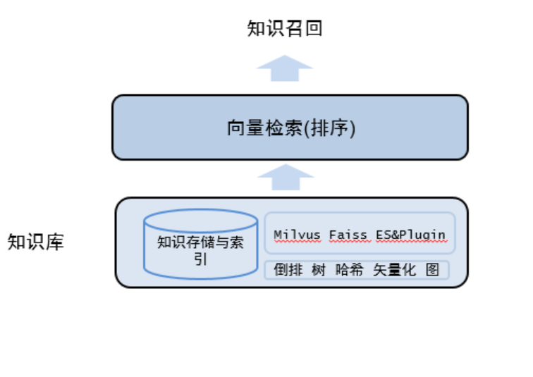
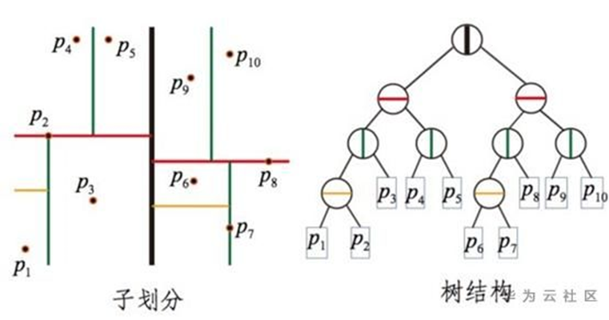
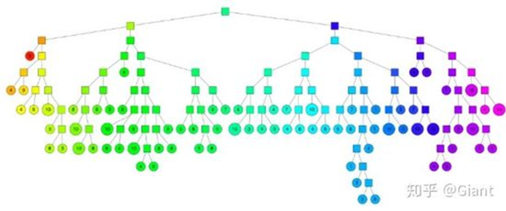
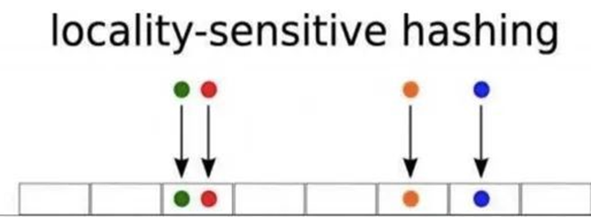
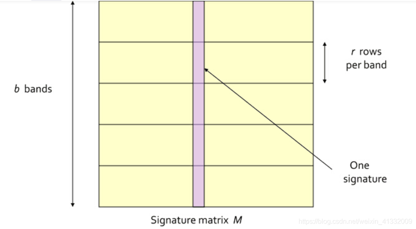
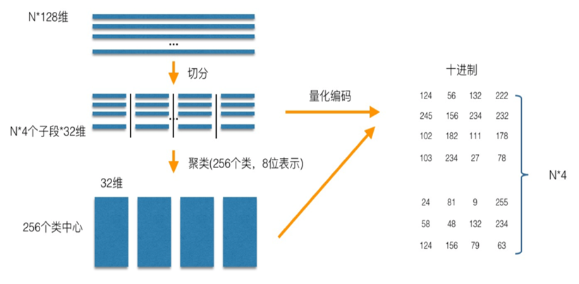
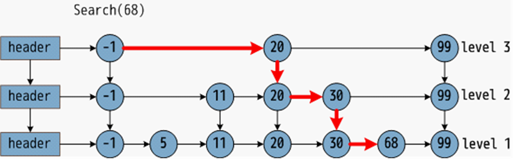
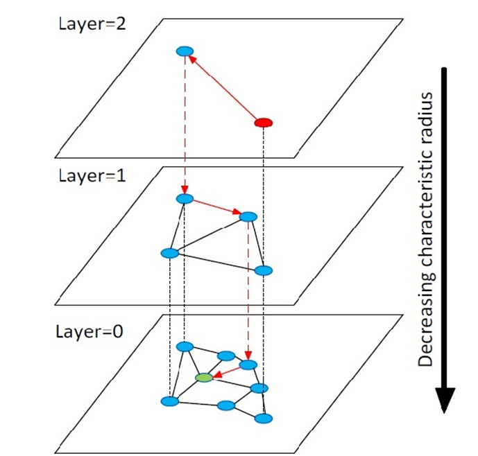

# VectorRetrieval

# 价值及落地场景
价值：目前在智能交互场景中可以提升文本的检索效果（准确率和召回率），进一步提升回复准确性。
落地场景：获取相似实体的需求都可以使用到
* 图片搜索：以图搜图，通过图片检索图片。具体应用如：车辆检索和商品图片检索等。
* 视频搜索：针对视频信息的实时轨迹跟踪。
* 文本搜索：基于语义的文本检索和推荐，通过文本检索近似文本。
* 语音搜索：声纹匹配，音频检索。
* 文件去重：通过文件指纹去除重复文件。

# 背景
* 高维及海量数据的存储：在常用的图片或视频处理场景中，向量数据通常在亿级别。
* 高召回：为保证检索效果，精度召回率通常要求 95% 以上。
* 高性能：为保证用户体验，向量检索的响应要求毫秒级。

# 框架

检索模型——暴力搜索、倒排索引
* BM25+semantic
* 倒排索引+BM25/semantic
特点：维护成本低
缺陷：耗时,占用内存大,准确率有待提升
##  检索模型——kd-Tree、Annoy

### KD-Tree:
* 构造：超平面去划分维度空间,方差最大的维度取中值
* 检索：递归访问KD-Tree，回溯计算距离
* 参数：返回个数K

### Annoy:
构造：聚类数为2的Kmeans
检索：递归访问Annoy-Tree，回溯计算距离
参数：返回个数K、树的深度

## 检索模型——LSH

局部敏感哈希

通过hash映射，将向量集映射到不同的hash桶中。高维空间的两点若距离很近，那么设计一种哈希函数对这两点进行哈希值计算，使得他们哈希值有很大的概率是一样的，若两点之间的距离较远，他们哈希值相同的概率会很小。

* 构造：通过hash函数映射，将向量集映射到不同的hash桶中
* 检索：hash函数映射到相应hash桶，对桶内样本求距离
* 余弦距离：H(V) = sign(V·R)
* 参数：hash函数个数、向量片段个数
* 特点：1.将高维数据降维到低维数据，内存耗用少；一定程度上保持原始数据的相似度不变。
* 缺陷：对于非均匀分布的向量空间效率和准确率较差。
* 改进：

向量切片

## 检索模型——PQ

针对N个训练样本，假设样本维度为128维，我们将其切分为4个子空间，则每一个子空间的维度为32维，然后我们在每一个子空间中，对子向量采用K-Means对其进行聚类(图中示意聚成256类)，这样每一个子空间都能得到编码N*4。这样训练样本的每个子段，都可以用子空间的聚类中心来近似，对应的编码即为类中心的ID
搜索过程：比对目标向量与各个聚类中心的距离，选择出与目标向量最为接近的若干个聚类中心。接下来获取这些聚类中心所对应聚类中的所有向量及其子段，分别计算每个子段各向量与目标向量的距离，将这些子段的距离求和相加

* 构造：通过 聚类方法将向量集合划分为多个聚类，并记录各个聚类的中心点的坐标
* 检索：比对聚类中心向量，选择对应簇的样本计算距离
* 参数：聚类簇个数、向量片段个数
* 特点：1.内存耗用更小;2.数据动态增删更灵活
* 缺陷：对于高维向量搜索效果一般。
* 优化：降维或者在PQ乘积量化之前，增加了一个粗量化，采用K-Means进行聚类

## 检索模型——NSW、HNSW

跳表

HNSW

### NSW:
* 构造：向图中逐个插入点，查找到与这个全新点最近的m个点，连接全新点到m个点的连线。
* 检索：贪婪算法
* 参数：连线个数m
### HNSW:
* 构造：基于跳表构建多层图网络
* 检索：从上往下依次查询，每一层达到局部最大值后跳转
* 参数：连线个数m、跳转概率
* 特点：较高的搜索效率；较高准确度；
* 缺陷：构建索引慢；占用内存大；

## 检索框架

### Elastic Search
* API
* 可扩展 
* 7.2+: match all 查询类似于向量检索，暴力搜索
* 向量检索插件

### Faiss
* 开源库
* 提供多种检索方法
* 可存在内存和磁盘中
* C++实现，提供Python封装调用。
* 大部分算法支持GPU实现

### Milvus
* API
* 基于 Faiss等索引库之上
* 多模态检索
* 动态数据管理

## 业界的落地情况
### Milvus

* 贝壳找房：智能客服、户型检索
* 爱奇艺：视频检索
* 搜狗：新闻检索、文本辅助标注
* 丁香园：文章检索、社区讨论检索、商品检索

### Faiss
* 58同城：职位检索

